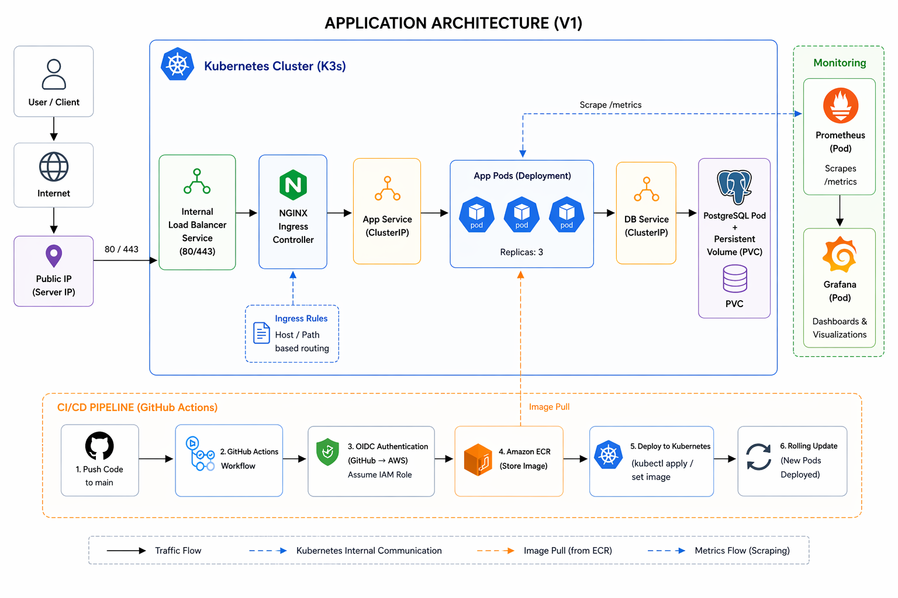
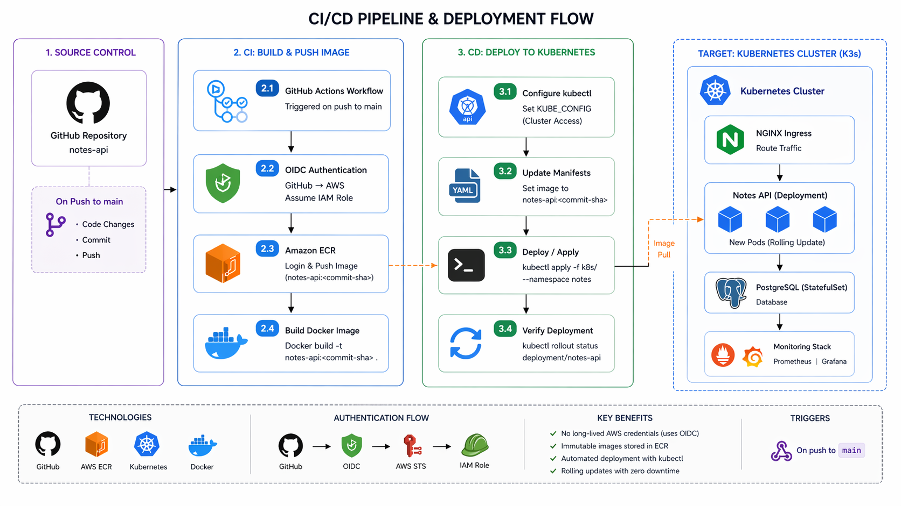
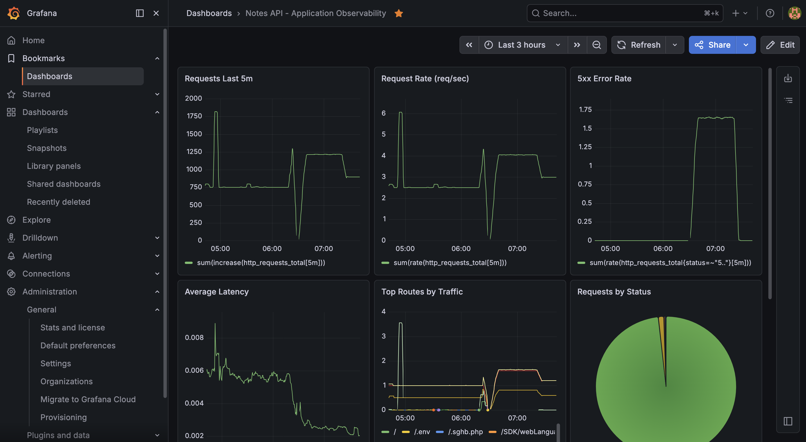

# 🚀 Notes API DevOps Project

A production-focused DevOps project that demonstrates how to build, containerize, provision, deploy, expose, automate, secure, and monitor a Node.js Notes API on a K3s Kubernetes cluster running on AWS EC2.

This project focuses on practical DevOps implementation using:

- Terraform for infrastructure provisioning
- EC2 user data for K3s bootstrap automation
- Docker for building application images
- AWS ECR for private container image storage
- K3s for Kubernetes orchestration
- NGINX Ingress Controller for external traffic routing
- GitHub Actions for CI/CD automation
- Prometheus and Grafana for monitoring and observability

---

# 📌 Project Overview

This repository contains a containerized Notes API built with Node.js and PostgreSQL.

The application is deployed on a self-managed K3s cluster running on AWS EC2. Infrastructure is provisioned using Terraform, application images are stored in AWS ECR, and deployments are automated using GitHub Actions.

The project demonstrates a real-world DevOps workflow from infrastructure provisioning to Kubernetes deployment, traffic exposure, CI/CD, private image pulling, monitoring, and operational troubleshooting.

---

# 🎯 Project Scope

This is a **K3s/Kubernetes-focused DevOps project**.

Docker is used to build the application image, but the runtime environment is Kubernetes/K3s.

This project does **not** rely on Docker Compose for deployment.

The production-style runtime flow is:

```text
Terraform
  ↓
AWS EC2 Infrastructure
  ↓
K3s Cluster Bootstrap
  ↓
Docker Image Build
  ↓
AWS ECR
  ↓
K3s Kubernetes Deployment
  ↓
NGINX Ingress Controller
  ↓
Kubernetes Services
  ↓
Application Pods
  ↓
Prometheus + Grafana Monitoring
```

---

# 🏗️ Architecture



## High-Level Architecture

```text
User / Browser
  ↓
EC2 Public IP :80
  ↓
K3s ServiceLB / klipper-lb
  ↓
ingress-nginx-controller Service (LoadBalancer)
  ↓
NGINX Ingress Controller Pod
  ↓
notes-app-ingress
  ↓
app-service (ClusterIP)
  ↓
Notes API Pods
```

If the request requires database access, the application connects internally to:

```text
Notes API Pod
  ↓
db-service (ClusterIP)
  ↓
PostgreSQL Pod
```

---

# 🧠 Architecture Notes

- Infrastructure is provisioned using **Terraform**
- K3s is installed automatically using EC2 **user data scripts**
- The Kubernetes cluster runs on **K3s** on AWS EC2
- The application runs as Kubernetes Pods behind an internal `ClusterIP` service
- External HTTP traffic is handled by **NGINX Ingress Controller**
- K3s **ServiceLB (klipper-lb)** exposes the Ingress Controller service without using an AWS-managed load balancer
- The application Ingress rule routes `/` traffic to `app-service:3000`
- Internal communication uses Kubernetes `ClusterIP` services
- PostgreSQL runs inside the cluster for V1 learning purposes and is accessed internally through `db-service`
- The application image is stored in private **AWS ECR**
- Kubernetes pulls private ECR images using `imagePullSecrets`
- The CI/CD pipeline refreshes the ECR pull secret before deployment to avoid expired-token image pull failures
- Prometheus scrapes application metrics through a Kubernetes `ServiceMonitor`
- Grafana visualizes traffic, latency, errors, CPU, and memory metrics

---

# ⚙️ Tech Stack

## Application

- Node.js
- Express.js
- PostgreSQL

## Infrastructure

- AWS EC2
- AWS IAM
- AWS Security Groups
- Elastic IP
- Terraform
- EC2 User Data

## Containers & Registry

- Docker
- AWS ECR
- Kubernetes imagePullSecrets

## Orchestration

- Kubernetes
- K3s
- Kubernetes Deployments
- Kubernetes Services
- Kubernetes ConfigMaps
- Kubernetes Secrets
- Kubernetes Ingress

## Traffic Management

- NGINX Ingress Controller
- K3s ServiceLB / klipper-lb
- ClusterIP Services

## CI/CD

- GitHub Actions
- AWS OIDC Authentication
- AWS ECR Push Workflow
- ECR Pull Secret Refresh
- Kubernetes Deployment Automation

## Monitoring

- Prometheus
- Grafana
- ServiceMonitor
- Custom Application Metrics
- Kubernetes Metrics

---

# ✨ Features

## Application Features

- CRUD Notes API
- Environment-based configuration
- PostgreSQL integration
- Structured logging
- Graceful shutdown
- Database retry logic

## Operational Endpoints

- `/health` → liveness check
- `/ready` → readiness check with database connectivity
- `/metrics` → Prometheus metrics endpoint

## DevOps Features

- Dockerized application
- Private image registry using AWS ECR
- Kubernetes deployment on K3s
- Terraform-based infrastructure provisioning
- EC2 user data bootstrap automation
- K3s server and worker node initialization
- Ingress-based external traffic routing
- CI/CD pipeline using GitHub Actions
- Secure AWS authentication using OIDC
- Private ECR image pulling using Kubernetes imagePullSecrets
- ECR pull secret refresh in the deployment pipeline
- Kubernetes rollout automation
- Prometheus and Grafana monitoring
- Production-style troubleshooting and observability

---

# 📂 Repository Structure

```text
.
├── .github/workflows/          # CI/CD pipelines
├── docs/                       # Project documentation
│   ├── ingress.md              # K3s ServiceLB + NGINX Ingress explanation
│   └── monitoring-dashboard.md # Grafana dashboard documentation
├── k8s/                        # Kubernetes application manifests
│   ├── app-deployment.yaml     # Notes API Deployment + app-service
│   ├── db-deployment.yaml      # PostgreSQL Deployment + db-service
│   ├── configmap.yaml          # Application configuration
│   ├── secrets.yaml            # Kubernetes secrets
│   └── ingress.yaml            # Application Ingress routing rule
├── monitoring/                 # Monitoring manifests
│   └── notes-api-servicemonitor.yaml
├── scripts/                    # Database initialization scripts
├── src/                        # Application source code
├── terraform/                  # Infrastructure as Code
│   ├── main.tf                 # AWS resources
│   ├── variables.tf            # Terraform input variables
│   ├── outputs.tf              # Terraform outputs
│   ├── user-data-server.sh     # K3s control-plane bootstrap
│   └── user-data-worker.sh     # K3s worker bootstrap
├── Dockerfile                  # Application image build
├── .env.example                # Environment variable template
└── README.md
```

---

# 🛠️ Infrastructure Provisioning with Terraform

Infrastructure is provisioned using **Terraform**.

Terraform is responsible for creating the AWS infrastructure required to run the K3s cluster.

## Terraform Responsibilities

Terraform provisions:

- K3s control-plane EC2 instance
- K3s worker EC2 instances
- Security group rules
- Elastic IP for the control-plane node
- K3s cluster token
- EC2 bootstrap using `user_data`

---

## K3s Bootstrap

The cluster is initialized automatically using EC2 user data scripts.

### Control Plane Bootstrap

The control-plane node installs K3s server using:

```text
terraform/user-data-server.sh
```

Key behavior:

- Sets the hostname to `k3s-control-plane`
- Installs required packages
- Installs K3s server
- Disables the default Traefik ingress controller
- Uses a generated K3s token
- Writes kubeconfig with readable permissions

```text
EC2 control-plane instance
  ↓
user-data-server.sh
  ↓
Install K3s server
  ↓
Disable Traefik
  ↓
Prepare cluster for NGINX Ingress Controller
```

Traefik is disabled because this project uses **NGINX Ingress Controller** for traffic routing.

---

### Worker Node Bootstrap

Worker nodes install K3s agent using:

```text
terraform/user-data-worker.sh
```

Each worker joins the K3s server using:

```text
K3S_URL=https://<k3s-server-private-ip>:6443
K3S_TOKEN=<generated-k3s-token>
```

Worker bootstrap flow:

```text
EC2 worker instance
  ↓
user-data-worker.sh
  ↓
Install K3s agent
  ↓
Connect to K3s server
  ↓
Join cluster as worker node
```

This allows Terraform to provision the infrastructure and bootstrap the Kubernetes cluster automatically.

---

## Terraform Outputs

Terraform outputs useful connection information such as:

- Control-plane public IP
- Control-plane private IP
- Worker public IPs
- Worker private IPs
- SSH command for connecting to the control-plane node

---

## Why Terraform Matters

Terraform makes the infrastructure:

- Repeatable
- Rebuildable
- Version-controlled
- Easier to document
- Easier to evolve into EKS later

---

# 🐳 Container Image

The application is containerized using Docker.

The image is built in CI/CD and pushed to AWS ECR.

```text
GitHub Actions
  ↓
docker build
  ↓
AWS ECR
  ↓
K3s pulls image
  ↓
Application pods run the new version
```

Docker is used for image creation, while K3s is used as the runtime platform.

---

# ☸️ K3s Deployment

The application is deployed using Kubernetes manifests stored under the `k8s/` directory.

```bash
kubectl apply -f k8s/
```

## Core Kubernetes Resources

The deployment creates:

- `app-deployment`
- `app-service`
- `db-deployment`
- `db-service`
- `notes-app-ingress`
- ConfigMap
- Secrets

## Verify Deployment

```bash
kubectl get pods
kubectl get svc
kubectl get ingress
```

Expected core resources:

```text
app-deployment-*      1/1 Running
db-deployment-*       1/1 Running

app-service           ClusterIP   3000/TCP
db-service            ClusterIP   5432/TCP

notes-app-ingress     nginx       <node-private-ip>   80
```

The application runs behind an internal `ClusterIP` service and is exposed externally through the NGINX Ingress Controller.

---

# 🌐 Traffic Exposure Model

This project exposes the Notes API using **NGINX Ingress Controller** on a K3s cluster.

K3s does not automatically provision an AWS-managed load balancer in this setup.

Instead, K3s uses:

```text
ServiceLB / klipper-lb
```

ServiceLB allows Kubernetes `LoadBalancer` services to be exposed through the EC2 node.

---

## End-to-End Traffic Flow

```text
User / Browser
  ↓
http://<EC2-Public-IP>:80
  ↓
K3s ServiceLB / klipper-lb
  ↓
ingress-nginx-controller Service (LoadBalancer)
  ↓
Ingress Controller Pod (NGINX)
  ↓
notes-app-ingress
  ↓
app-service (ClusterIP)
  ↓
Notes API Pods
```

If the requested endpoint needs database access:

```text
Notes API Pod
  ↓
db-service (ClusterIP)
  ↓
PostgreSQL Pod
```

---

## Application Ingress Rule

The routing rule is defined in:

```text
k8s/ingress.yaml
```

```yaml
apiVersion: networking.k8s.io/v1
kind: Ingress
metadata:
  name: notes-app-ingress
  namespace: default
spec:
  ingressClassName: nginx
  rules:
    - http:
        paths:
          - path: /
            pathType: Prefix
            backend:
              service:
                name: app-service
                port:
                  number: 3000
```

This means:

```text
/ → app-service:3000
```

Because `pathType` is `Prefix`, the same rule also matches:

```text
/health
/ready
/metrics
/api/notes
```

---

## Ingress Controller

The NGINX Ingress Controller is installed as a **cluster add-on** in the `ingress-nginx` namespace.

It is not stored as a Pod YAML in this application repository because the Ingress Controller Pod is generated and managed by the `ingress-nginx-controller` Deployment.

To verify the controller:

```bash
kubectl get deploy,svc,pods -n ingress-nginx
```

Expected resources:

```text
deployment.apps/ingress-nginx-controller

service/ingress-nginx-controller             LoadBalancer
service/ingress-nginx-controller-admission   ClusterIP

pod/ingress-nginx-controller-xxxxx           Running
```

The application Ingress uses:

```yaml
ingressClassName: nginx
```

This tells Kubernetes that the rule should be handled by the NGINX Ingress Controller.

---

# 🧩 Application Manifests vs Cluster Add-ons

This repository separates application-managed resources from cluster-level add-ons.

## Application-managed resources

These are part of the application deployment and are stored in this repository:

```text
k8s/app-deployment.yaml
k8s/db-deployment.yaml
k8s/configmap.yaml
k8s/secrets.yaml
k8s/ingress.yaml
monitoring/notes-api-servicemonitor.yaml
```

## Cluster add-ons

These are installed on the cluster and documented, but not managed as application manifests:

```text
NGINX Ingress Controller
K3s ServiceLB / klipper-lb
Prometheus Operator
Grafana
```

The application defines its routing through:

```text
k8s/ingress.yaml
```

The Ingress Controller is responsible for reading that rule and routing traffic accordingly.

---

# 🔄 CI/CD Pipeline



The CI/CD pipeline automates the application build and deployment process.

## Pipeline Responsibilities

- Build Docker image
- Authenticate securely to AWS using OIDC
- Push Docker image to AWS ECR
- Authenticate to the K3s cluster using kubeconfig
- Refresh the Kubernetes ECR image pull secret
- Update the Kubernetes deployment image
- Trigger a rolling update
- Verify rollout status

---

## CI/CD Flow

```text
Developer pushes code
  ↓
GitHub Actions starts
  ↓
Authenticate to AWS using OIDC
  ↓
Build Docker image
  ↓
Push image to AWS ECR
  ↓
Refresh Kubernetes ecr-secret
  ↓
Update Kubernetes deployment
  ↓
K3s pulls new image from private ECR
  ↓
Rolling update starts
  ↓
Application pods are replaced safely
```

---

# 🔐 Authentication & Access Model

This project uses a multi-layer authentication model.

## 1. GitHub Actions → AWS

GitHub Actions authenticates to AWS using **OpenID Connect (OIDC)**.

Benefits:

- No long-lived AWS access keys
- Temporary credentials
- IAM role-based access
- Improved CI/CD security

---

## 2. GitHub Actions → K3s Cluster

The pipeline uses kubeconfig to access the K3s cluster.

Used for:

- `kubectl apply`
- `kubectl create secret`
- `kubectl set image`
- `kubectl rollout status`

---

## 3. K3s Cluster → AWS ECR

The application image is stored in a private AWS ECR repository.

Because the ECR repository is private, Kubernetes needs an image pull secret to authenticate when pulling the image.

The application deployment uses:

```yaml
imagePullSecrets:
  - name: ecr-secret
```

This secret stores temporary ECR registry authentication data.

---

## Important ECR Token Behavior

AWS ECR authentication tokens are temporary and valid for **12 hours**.

That means the Kubernetes `ecr-secret` can expire.

If the cluster tries to pull a private ECR image after the token expires, pods may fail with:

```text
ImagePullBackOff
ErrImagePull
```

This can happen when:

- A new pod is created
- A deployment is restarted
- Replicas are scaled up
- A rollout happens
- A manifest is applied manually using `kubectl`
- A node loses the cached image and needs to pull again

To avoid this, the CI/CD pipeline refreshes the ECR pull secret before deploying the application.

---

# 🔁 ECR imagePullSecret Refresh

This project uses AWS ECR as a private container registry.

Kubernetes pulls the Notes API image from ECR using an image pull secret named:

```text
ecr-secret
```

The application deployment references this secret through:

```yaml
imagePullSecrets:
  - name: ecr-secret
```

---

## Why Refresh Is Required

ECR registry authentication tokens are temporary.

AWS ECR tokens are valid for **12 hours**, so the Kubernetes pull secret must be refreshed regularly or before any deployment that may require pulling a new image.

If the secret expires, Kubernetes may fail to pull the image and the pod can enter:

```text
ImagePullBackOff
```

---

## Pipeline Refresh Strategy

The GitHub Actions pipeline refreshes the ECR pull secret before updating the Kubernetes deployment.

The refresh step gets a fresh ECR token and recreates/applies the Kubernetes docker-registry secret:

```bash
aws ecr get-login-password --region "$AWS_REGION" | \
kubectl create secret docker-registry ecr-secret \
  --docker-server="$ECR_REGISTRY" \
  --docker-username=AWS \
  --docker-password="$(cat -)" \
  --namespace "$NAMESPACE" \
  --dry-run=client -o yaml | kubectl apply -f -
```

---

## How It Works

```text
GitHub Actions
  ↓
Authenticate to AWS using OIDC
  ↓
Request fresh ECR token
  ↓
Create or update Kubernetes ecr-secret
  ↓
Update deployment image
  ↓
K3s pulls image from private ECR
  ↓
Rolling update completes
```

---

## Manual kubectl Updates Warning

If changes are made directly on the cluster using `kubectl`, the ECR pull secret may need to be refreshed manually before restarting, scaling, or redeploying pods.

Examples of manual actions that may require a fresh ECR secret:

```bash
kubectl rollout restart deployment/app-deployment
kubectl scale deployment/app-deployment --replicas=6
kubectl apply -f k8s/
kubectl delete pod <pod-name>
```

If the ECR token inside `ecr-secret` is expired, these actions can cause new pods to fail with:

```text
ImagePullBackOff
```

---

## Manual Refresh Command

When working manually with `kubectl`, refresh the ECR pull secret before forcing Kubernetes to pull the image:

```bash
AWS_REGION="us-east-1"
ECR_REGISTRY="<aws-account-id>.dkr.ecr.us-east-1.amazonaws.com"
NAMESPACE="default"

aws ecr get-login-password --region "$AWS_REGION" | \
kubectl create secret docker-registry ecr-secret \
  --docker-server="$ECR_REGISTRY" \
  --docker-username=AWS \
  --docker-password="$(cat -)" \
  --namespace "$NAMESPACE" \
  --dry-run=client -o yaml | kubectl apply -f -
```

Then restart the deployment if needed:

```bash
kubectl rollout restart deployment/app-deployment
kubectl rollout status deployment/app-deployment
```

---

## Troubleshooting ImagePullBackOff

If pods fail to pull the image:

```bash
kubectl get pods
kubectl describe pod <pod-name>
```

Look for events such as:

```text
Failed to pull image
ErrImagePull
ImagePullBackOff
no basic auth credentials
authorization token has expired
```

Then refresh the ECR secret and restart the deployment:

```bash
aws ecr get-login-password --region "$AWS_REGION" | \
kubectl create secret docker-registry ecr-secret \
  --docker-server="$ECR_REGISTRY" \
  --docker-username=AWS \
  --docker-password="$(cat -)" \
  --namespace "$NAMESPACE" \
  --dry-run=client -o yaml | kubectl apply -f -

kubectl rollout restart deployment/app-deployment
kubectl rollout status deployment/app-deployment
```

---

## Future Improvement

A more production-ready approach would be to avoid manual token refresh by using one of the following:

- ECR credential provider for Kubernetes nodes
- External Secrets Operator with an ECR token generator
- EKS with IAM-integrated image pulling
- A scheduled Kubernetes job or controller to refresh the secret

For this V1 K3s project, the refresh is handled in the CI/CD pipeline.

---

# 🔐 Security Summary

- No static AWS credentials in GitHub
- AWS access is handled through OIDC
- Application image is stored in private ECR
- Cluster access is controlled through kubeconfig
- Kubernetes Secrets are used for sensitive runtime configuration
- `ecr-secret` is used to pull private images from ECR
- The CI/CD pipeline refreshes the ECR pull secret before deployment
- Application services remain internal using `ClusterIP`
- External access is handled through Ingress only

---

# 📊 Monitoring & Observability

This project includes a production-style monitoring stack using **Prometheus** and **Grafana**.

The Notes API exposes application metrics at:

```text
/metrics
```

Prometheus discovers and scrapes the application using a Kubernetes `ServiceMonitor`.

---

## Monitoring Flow

```text
Notes API Pods
  ↓
app-service
  ↓
ServiceMonitor
  ↓
Prometheus
  ↓
Grafana Dashboard
```

---

## ServiceMonitor

The application is monitored through:

```text
monitoring/notes-api-servicemonitor.yaml
```

It selects the application service and scrapes:

```text
port: http
path: /metrics
interval: 5s
```

---

## Dashboard Panels

- Requests Last 5 Minutes
- Request Rate
- Average Latency
- 5xx Error Rate
- Requests by HTTP Status
- Top Routes by Traffic
- CPU Usage
- Memory Usage

---

## Dashboard Preview



For full monitoring documentation, see:

```text
docs/monitoring-dashboard.md
```

---

# 📈 Custom Metrics

The application exposes Prometheus-compatible metrics using `prom-client`.

## Counter

```text
http_requests_total
```

Tracks total HTTP requests with labels:

- method
- route
- status

## Histogram

```text
http_request_duration_seconds
```

Tracks request duration for latency analysis.

Used for:

- Average latency
- Future P95/P99 latency panels
- Request performance analysis

---

# 🧪 Operational Endpoints

## Health Check

```http
GET /health
```

Used to check whether the application process is running.

This endpoint does not depend on database connectivity.

---

## Readiness Check

```http
GET /ready
```

Used to check whether the application is ready to serve traffic.

This endpoint checks database connectivity.

In Kubernetes, readiness determines whether a pod should receive traffic from the service.

---

## Metrics Endpoint

```http
GET /metrics
```

Exposes Prometheus-compatible application metrics.

Prometheus scrapes this endpoint using the configured `ServiceMonitor`.

---

# 🧠 DevOps Practices Demonstrated

This project demonstrates:

- Infrastructure as Code with Terraform
- Terraform-based K3s infrastructure provisioning
- EC2 bootstrap automation using user data
- K3s server and worker node initialization
- Docker image creation
- Private image registry workflow with AWS ECR
- Private ECR image pulling using Kubernetes imagePullSecrets
- CI/CD-based ECR pull secret refresh
- ImagePullBackOff troubleshooting caused by expired registry credentials
- Kubernetes deployment on K3s
- Kubernetes Services and Ingress routing
- K3s ServiceLB traffic exposure
- CI/CD automation with GitHub Actions
- Secure AWS authentication with OIDC
- Kubernetes rollout strategy
- Prometheus metrics collection
- Grafana dashboard visualization
- Health and readiness checks
- Production-style troubleshooting
- Monitoring-driven operational thinking

---

# 🧯 Troubleshooting Examples

## Check application pods

```bash
kubectl get pods
```

## Check services

```bash
kubectl get svc
```

## Check ingress

```bash
kubectl get ingress
kubectl describe ingress notes-app-ingress
```

## Check application logs

```bash
kubectl logs deployment/app-deployment --tail=100
```

## Check rollout status

```bash
kubectl rollout status deployment/app-deployment
```

## Check service endpoints

```bash
kubectl get endpoints app-service
```

## Check Ingress Controller

```bash
kubectl get deploy,svc,pods -n ingress-nginx
```

## Check Prometheus ServiceMonitor

```bash
kubectl get servicemonitor
kubectl describe servicemonitor notes-api-servicemonitor
```

## Fix ImagePullBackOff from expired ECR token

If a pod fails with `ImagePullBackOff`, refresh the ECR pull secret:

```bash
AWS_REGION="us-east-1"
ECR_REGISTRY="<aws-account-id>.dkr.ecr.us-east-1.amazonaws.com"
NAMESPACE="default"

aws ecr get-login-password --region "$AWS_REGION" | \
kubectl create secret docker-registry ecr-secret \
  --docker-server="$ECR_REGISTRY" \
  --docker-username=AWS \
  --docker-password="$(cat -)" \
  --namespace "$NAMESPACE" \
  --dry-run=client -o yaml | kubectl apply -f -
```

Then restart the deployment:

```bash
kubectl rollout restart deployment/app-deployment
kubectl rollout status deployment/app-deployment
```

---

# 🚧 Current Limitations

This V1 setup is designed for learning and portfolio demonstration.

Current limitations:

- K3s is self-managed on EC2
- No AWS-managed load balancer is used
- ServiceLB exposes traffic through the node
- PostgreSQL runs inside the cluster instead of using a managed database
- ECR token refresh is handled by pipeline/manual command instead of a fully automated cluster-native credential provider
- No high availability database setup
- Scaling is mostly manual
- No GitOps controller yet
- No centralized log aggregation yet
- No alerting rules yet

---

# 🚀 Future Improvements

Planned improvements:

- Migrate from K3s to EKS
- Replace K3s ServiceLB with AWS Load Balancer integration
- Move PostgreSQL from in-cluster Pod to Amazon RDS
- Replace ECR pull secret refresh with IAM-integrated image pulling where possible
- Add Helm charts for application packaging
- Implement Argo CD for GitOps delivery
- Use AWS Secrets Manager with External Secrets Operator
- Add Horizontal Pod Autoscaler (HPA)
- Add alerting rules in Prometheus / Grafana
- Add Loki for log aggregation
- Add P95 / P99 latency panels
- Add PostgreSQL exporter for database metrics
- Add node-level infrastructure dashboards
- Add Cloudflare and DNS-based access

---

# 🏭 Future Production Architecture

The future production version can evolve into:

```text
User
  ↓
DNS / Cloudflare / Route 53
  ↓
AWS Load Balancer
  ↓
EKS
  ↓
Ingress / AWS Load Balancer Controller
  ↓
Application Service
  ↓
Application Pods
  ↓
Amazon RDS
```

---

# 👨‍💻 Author

**Ameer Adel**

DevOps-focused engineer building real-world, production-style projects to strengthen skills in Kubernetes, CI/CD, cloud infrastructure, automation, monitoring, and system design.

---

# ⭐ Why This Project Matters

This is not just a CRUD API deployment.

It demonstrates a complete DevOps lifecycle:

- Provision infrastructure
- Bootstrap a Kubernetes cluster
- Build application images
- Store images in a private registry
- Deploy workloads to Kubernetes
- Expose services through Ingress
- Secure CI/CD authentication
- Handle private registry image pulling
- Refresh ECR image pull credentials
- Monitor traffic and performance
- Troubleshoot using real operational signals

---

# 💬 Final Note

This project focuses on:

- Deep understanding
- Real-world DevOps practices
- Production-style deployment
- Kubernetes networking
- Secure automation
- Private registry authentication
- Observability
- Operational troubleshooting

It reflects how modern DevOps systems are designed, deployed, exposed, monitored, secured, and improved over time.