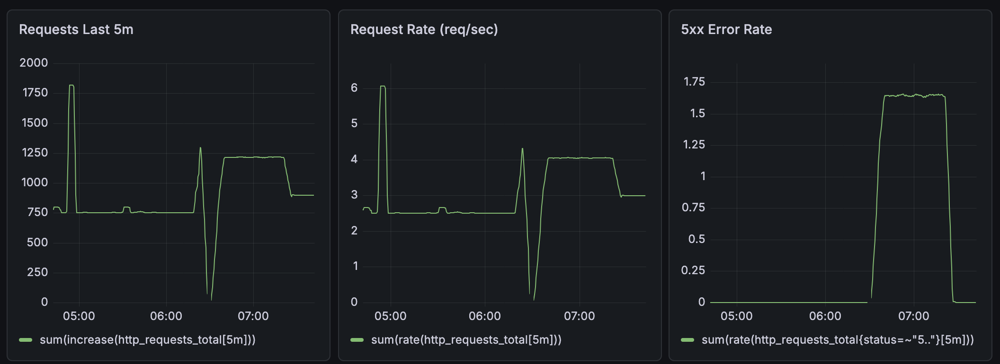
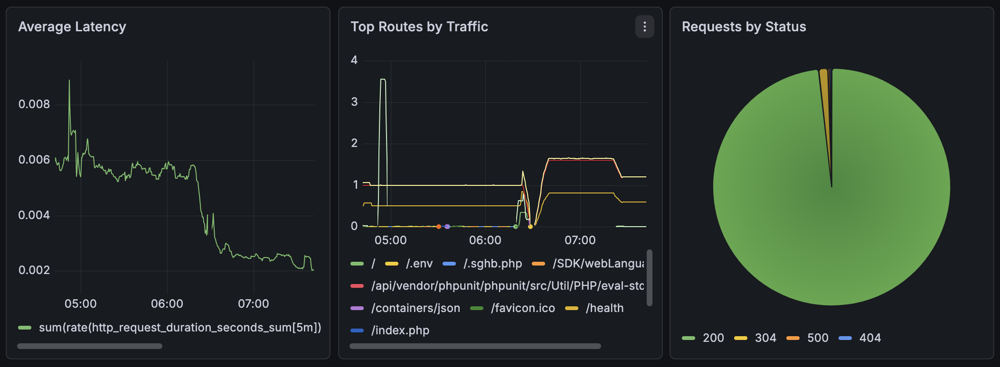
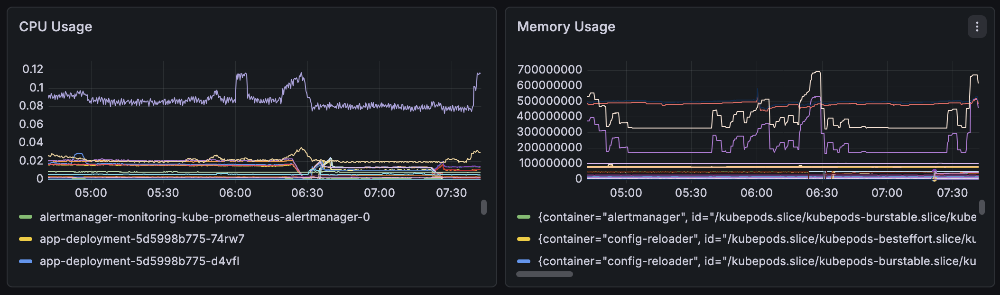

# Grafana Monitoring Dashboard

## Overview

This document explains the Grafana monitoring dashboard used in the Notes API DevOps project.

The dashboard is designed to provide operational visibility into the application running on Kubernetes. It helps monitor traffic, request rate, errors, latency, route usage, HTTP status codes, and pod-level resource usage.

The monitoring stack is built with:

- **Prometheus** for scraping and storing metrics.
- **Grafana** for dashboard visualization.
- **Kubernetes metrics** for CPU and memory visibility.
- **Custom application metrics** exposed by the Notes API on `/metrics`.

The goal is not only to show that the application is running, but also to understand how it behaves under real traffic.

---

## Monitoring Architecture

```text
Users
  |
  v
Load Balancer / NGINX Ingress
  |
  v
Notes API Service
  |
  v
Notes API Pods
  |
  v
/metrics endpoint
  |
  v
Prometheus
  |
  v
Grafana Dashboard
```

The Notes API exposes Prometheus-compatible metrics from the `/metrics` endpoint. Prometheus scrapes this endpoint through a Kubernetes `ServiceMonitor`, then Grafana reads the collected metrics from Prometheus and visualizes them in dashboards.

---

## Dashboard Screenshots

### Traffic and Error Overview



This section provides a high-level overview of recent traffic, request rate, server-side errors, and average latency.

---

### Routes, Status Codes, and Latency



This section helps identify which routes receive the most traffic, how the application responds, and whether latency is increasing.

---

### CPU and Memory Usage



This section monitors Kubernetes container resource usage, helping detect CPU pressure, memory growth, and possible scaling needs.

---

# Dashboard Panels

## 1. Requests Last 5 Minutes

### Purpose

This panel shows the total number of HTTP requests received by the Notes API during the last 5 minutes.

### PromQL Query

```promql
sum(increase(http_requests_total[5m]))
```

### How It Works

The application exposes a counter metric called `http_requests_total`.

A counter always increases over time. The `increase()` function calculates how much the counter increased during a specific time window.

In this case:

```promql
increase(http_requests_total[5m])
```

means:

> How many new requests happened during the last 5 minutes?

Then `sum()` adds all routes, methods, pods, and statuses together to show one total number.

### Why It Is Useful

This panel gives a quick understanding of recent traffic volume.

It helps answer questions like:

- Is the application receiving traffic?
- Did traffic suddenly increase?
- Did traffic suddenly drop?
- Did a load test actually reach the application?
- Is public internet traffic hitting the service?

### DevOps Usage

During an incident, this panel helps determine whether the issue is caused by traffic behavior.

For example:

- High requests + high errors may indicate the application is under pressure.
- Low requests + user complaints may indicate ingress, DNS, or load balancer issues.
- Sudden traffic spikes may indicate bots, scanners, or a load test.

---

## 2. Request Rate

### Purpose

This panel shows the live request throughput of the application in requests per second.

### PromQL Query

```promql
sum(rate(http_requests_total[5m]))
```

### How It Works

The `rate()` function calculates the per-second average increase of a counter over a time window.

In this case:

```promql
rate(http_requests_total[5m])
```

means:

> What is the average number of requests per second during the last 5 minutes?

Then `sum()` combines all application pods, routes, methods, and statuses into one total request rate.

### Difference Between `increase()` and `rate()`

`increase()` answers:

> How many requests happened in total during this time window?

`rate()` answers:

> How fast are requests arriving per second?

Example:

```promql
sum(increase(http_requests_total[5m]))
```

is useful for total recent traffic.

```promql
sum(rate(http_requests_total[5m]))
```

is useful for live throughput.

### Why It Is Useful

Request rate is one of the most important production traffic indicators.

It helps with:

- Understanding live load.
- Capacity planning.
- Comparing traffic before and after deployments.
- Detecting sudden spikes.
- Validating performance tests.

### DevOps Usage

If request rate increases while latency and CPU also increase, the application may need scaling.

If request rate drops to zero while users report downtime, traffic may not be reaching the application.

---

## 3. 5xx Error Rate

### Purpose

This panel tracks server-side errors returned by the application.

### PromQL Query

```promql
sum(rate(http_requests_total{status=~"5.."}[5m]))
```

### How It Works

The application records each request with a status code label.

This query filters only status codes matching:

```text
5..
```

That means:

- `500 Internal Server Error`
- `502 Bad Gateway`
- `503 Service Unavailable`
- `504 Gateway Timeout`

The `rate()` function calculates how many 5xx responses are happening per second.

### Why It Is Useful

5xx errors are critical because they usually mean the problem is on the server side, not the client side.

Common causes include:

- Application bugs.
- Database connection failures.
- Missing database tables.
- Failed upstream service.
- Broken deployment.
- Readiness or backend availability problems.
- Runtime exceptions.

### DevOps Usage

This panel is very important during deployments.

After every rollout, check this panel to confirm that the new version did not introduce server-side failures.

A healthy application should normally have a 5xx error rate close to zero.

### Incident Example

If this panel spikes after a deployment, the next debugging steps should be:

```bash
kubectl get pods
kubectl logs deployment/app-deployment --tail=100
kubectl describe pod <pod-name>
kubectl get endpoints app-service
```

This helps determine whether the issue is caused by application errors, failed readiness, or missing service endpoints.

---

## 4. Average Latency

### Purpose

This panel shows the average request duration for the Notes API.

### PromQL Query

```promql
sum(rate(http_request_duration_seconds_sum[5m]))
/
sum(rate(http_request_duration_seconds_count[5m]))
```

### How It Works

The application exposes request duration using a histogram metric.

Prometheus histograms usually include:

```text
http_request_duration_seconds_sum
http_request_duration_seconds_count
http_request_duration_seconds_bucket
```

The `_sum` metric stores the total accumulated request duration.

The `_count` metric stores the total number of observed requests.

To calculate average latency:

```text
total request duration / total request count
```

That is why the query divides:

```promql
rate(http_request_duration_seconds_sum[5m])
```

by:

```promql
rate(http_request_duration_seconds_count[5m])
```

### Why It Is Useful

Latency shows how fast or slow the application is responding.

Even if the application is returning `200 OK`, it may still be unhealthy if responses are slow.

### DevOps Usage

Latency helps detect:

- Slow database queries.
- CPU pressure.
- Network delay.
- Application performance regressions.
- Too many requests hitting one endpoint.
- Resource limits affecting performance.

### Healthy Pattern

A healthy API usually has stable latency.

A sudden spike in latency may indicate that the app is struggling even before errors appear.

---

## 5. Top Routes by Traffic

### Purpose

This panel shows which HTTP routes receive the most requests.

### Example Routes

Common expected routes include:

```text
/
 /health
 /ready
 /metrics
 /api/notes
```

Public internet traffic may also show unexpected routes such as:

```text
/.env
/index.php
/vendor/phpunit
/SDK/webLanguage
```

### How It Works

The application records the route label for each request.

A typical query for this panel may look like:

```promql
sum by (route) (rate(http_requests_total[5m]))
```

This groups request rate by route.

### Why It Is Useful

This panel helps understand real traffic behavior.

It answers:

- Which endpoint is used the most?
- Are health checks generating most of the traffic?
- Is `/api/notes` receiving real application traffic?
- Are bots scanning the public endpoint?
- Are unknown routes being requested?

### DevOps Usage

This panel is useful for both operations and security awareness.

If the top routes are only `/health`, `/ready`, and `/metrics`, then most traffic may be internal monitoring or health checks.

If unknown routes appear, that usually means the application is exposed publicly and is being scanned by automated bots.

This is common on public servers and shows why monitoring is important.

### Security Note

Seeing routes like:

```text
/.env
/wp-admin
/index.php
/vendor/phpunit
```

does not mean the application is compromised.

It usually means automated scanners are probing the server for common vulnerabilities.

However, it confirms that public services should be protected with proper security practices.

---

## 6. Requests by Status Code

### Purpose

This panel shows the distribution of HTTP responses by status code.

### Example Status Codes

```text
200 - Successful request
304 - Not modified / cached response
400 - Bad request
404 - Route not found
500 - Internal server error
503 - Service unavailable
```

### Example PromQL Query

```promql
sum by (status) (rate(http_requests_total[5m]))
```

### How It Works

The application records each request with a `status` label.

Grafana groups requests by HTTP status code to show how many successful, failed, or not found responses are being returned.

### Why It Is Useful

This panel gives a fast health summary of the application.

For example:

- Mostly `200` means the app is serving successfully.
- Many `404` responses may indicate wrong URLs or scanners.
- Any sustained `500` responses indicate application-side problems.
- `503` may indicate unavailable upstreams, missing endpoints, or readiness issues.

### DevOps Usage

This panel is useful when debugging user reports.

If users say the app is down, this panel quickly shows whether the app is returning errors or if traffic is not reaching it at all.

---

## 7. CPU Usage

### Purpose

This panel shows CPU usage across Kubernetes containers and pods.

### How It Works

Kubernetes metrics are collected and exposed to Prometheus.

A common query may use container CPU usage metrics such as:

```promql
sum by (pod) (rate(container_cpu_usage_seconds_total{namespace="default"}[5m]))
```

The exact query may differ depending on the installed monitoring stack and labels.

### Why It Is Useful

CPU usage shows whether the application is under compute pressure.

High CPU usage can cause:

- Slower response times.
- Increased latency.
- Request timeouts.
- Pod throttling if CPU limits are configured.
- Poor performance during traffic spikes.

### DevOps Usage

This panel helps with:

- Tuning CPU requests and limits.
- Deciding whether to increase replicas.
- Detecting runaway processes.
- Validating load test behavior.
- Planning Horizontal Pod Autoscaler usage.

### Scaling Insight

If request rate increases and CPU usage increases at the same time, the application may benefit from more replicas.

If CPU is low but latency is high, the bottleneck may be database, network, or application logic instead of CPU.

---

## 8. Memory Usage

### Purpose

This panel shows memory usage across Kubernetes containers and pods.

### How It Works

Kubernetes exposes memory metrics for containers.

A common query may use:

```promql
sum by (pod) (container_memory_working_set_bytes{namespace="default"})
```

The exact query may differ depending on the monitoring stack labels.

### Why It Is Useful

Memory is critical in Kubernetes because containers can be killed if they exceed their memory limits.

Memory issues may lead to:

- OOMKilled pods.
- Pod restarts.
- Application instability.
- Gradual performance degradation.
- Node memory pressure.

### DevOps Usage

This panel helps detect:

- Memory leaks.
- Incorrect memory limits.
- Unstable application behavior.
- Resource pressure during traffic spikes.
- Whether pod memory usage is stable over time.

### Senior Engineering Pattern

A memory graph that keeps increasing and never goes down may indicate a memory leak.

Stable memory usage usually means the application runtime is healthy.

---

# How This Dashboard Helps During Operations

## During Deployment

After deploying a new version, this dashboard helps verify that the rollout is healthy.

Check:

- Did 5xx errors increase?
- Did latency increase?
- Did request rate recover normally?
- Are pods using abnormal CPU or memory?
- Are status codes mostly successful?

Useful commands during deployment validation:

```bash
kubectl rollout status deployment/app-deployment
kubectl get pods
kubectl get endpoints app-service
kubectl logs deployment/app-deployment --tail=100
```

---

## During an Incident

This dashboard gives a practical investigation path.

Start with:

1. **Requests Last 5m**  
   Check whether traffic is reaching the app.

2. **5xx Error Rate**  
   Check whether the application is failing.

3. **Average Latency**  
   Check whether the application is becoming slow.

4. **Requests by Status**  
   Check which status codes are increasing.

5. **Top Routes by Traffic**  
   Check whether a specific route is causing the issue.

6. **CPU and Memory**  
   Check whether the issue is caused by resource pressure.

---

## During Scaling Decisions

This dashboard helps make scaling decisions based on real metrics instead of guessing.

Useful signals:

- High request rate.
- High CPU usage.
- Increasing latency.
- Stable traffic but increasing memory.
- Repeated errors during traffic spikes.

Possible actions:

- Increase application replicas.
- Tune CPU and memory requests.
- Add Horizontal Pod Autoscaler.
- Optimize slow routes.
- Move database to a managed service.
- Improve caching or connection pooling.

---

# Production Value

This dashboard demonstrates important DevOps and SRE practices:

- Observability.
- Metrics-based debugging.
- Kubernetes monitoring.
- Application performance visibility.
- Incident response thinking.
- Capacity planning.
- Understanding the difference between app health, readiness, and real user traffic.

A production system should not only be deployed successfully. It should also be observable, measurable, and debuggable.

---

# Current Monitoring Scope

This dashboard currently focuses on:

- HTTP traffic.
- Request rate.
- Server-side errors.
- Average latency.
- Route-level visibility.
- Status code distribution.
- CPU usage.
- Memory usage.

This is a strong monitoring foundation for a DevOps portfolio project.

---

# Recommended Future Improvements

The following improvements can be added later to make the monitoring stack more production-ready:

## 1. P95 and P99 Latency

Average latency is useful, but percentiles are better for understanding real user experience.

Recommended future query:

```promql
histogram_quantile(
  0.95,
  sum(rate(http_request_duration_seconds_bucket[5m])) by (le)
)
```

## 2. Pod Restart Monitoring

Track unstable pods and crash loops.

## 3. Alerting Rules

Add alerts for:

- High 5xx error rate.
- High latency.
- Pod restarts.
- High CPU usage.
- High memory usage.
- Application down.
- Prometheus target down.

## 4. Database Metrics

Add PostgreSQL exporter to monitor:

- Active connections.
- Query performance.
- Locks.
- Database size.
- Transaction rate.

## 5. Node-Level Dashboards

Monitor:

- Node CPU.
- Node memory.
- Disk usage.
- Network traffic.
- Node pressure conditions.

## 6. Notification Integration

Connect Alertmanager with:

- Slack.
- Email.
- Telegram.
- PagerDuty.

---

# Final Summary

The Grafana dashboard gives the Notes API project real operational visibility.

It allows a DevOps engineer to answer important production questions:

- Is the application receiving traffic?
- Is the application healthy?
- Are users getting errors?
- Is latency acceptable?
- Which routes are being used most?
- Are pods consuming too much CPU or memory?
- Is the system ready to scale?

This turns the project from a simple Kubernetes deployment into a monitored, production-style platform.

Monitoring is what allows engineers to move from guessing to knowing.